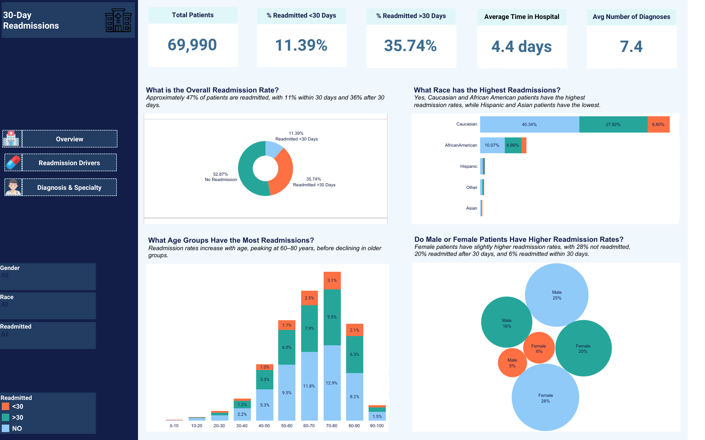
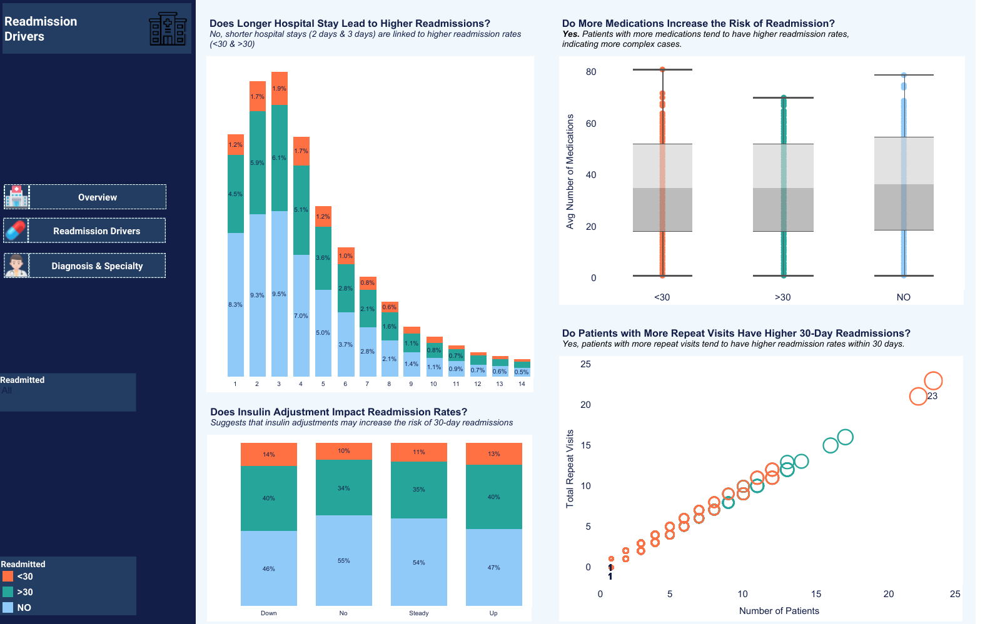
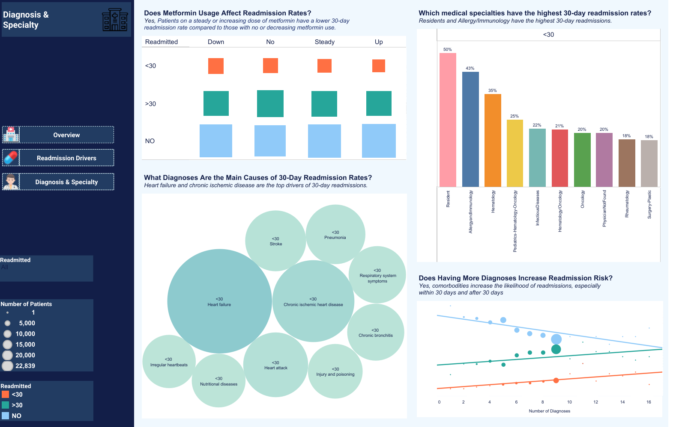

# Diabetes 30-Day Readmissions Analysis  

This project looks at why diabetic patients are readmitted to the hospital within 30 days of discharge. High 30-day readmission rates increase hospital costs and reduce the quality of patient care. The goal of this project is to find the key reasons behind these readmissions and suggest ways to reduce them.  

## **Project Overview**  
- **Goal:** Find the main factors driving 30-day readmissions in diabetic patients and suggest ways to reduce them.  
- **Dataset:** UCI Diabetes 130-US Hospitals (1999–2008)  
- **Tools Used:**  
   - Python (for data analysis)  
   - Tableau (for interactive visualizations)

## **How the Analysis Was Done**  
### 1. **Python (Data Cleaning and Analysis):**  
- Cleaned the dataset by fixing missing values
- Removed irrelevant records (like death and hospice cases). This is because a patient dying or transferred to a hospice home doesn't represent positive recovery outcome.  
- Created new features to track medication use and repeat visits.  
- Explored key factors like:  
   - Patient demographics (age, gender, race)  
   - Hospital stay details (length of stay, lab tests, number of diagnoses, discharge disposition)  
   - Medication use (insulin, metformin, glipizide, glyburide, combination therapies)  
   - Diagnoses and specialty care  
   - Repeat visits and comorbidities  

### 2. **Tableau (Dashboard Creation):**  
- Built a clear and interactive Tableau dashboard to show the patterns and insights visually.  
- The dashboard includes:  
   - **Page 1:** Overview of readmission rates by age, gender, and race.  
   - **Page 2:** Key drivers of readmissions (hospital stay, medication use, repeat visits).  
   - **Page 3:** Impact of diagnoses and specialty care on readmissions.

## **Key Insights**  
✅ **Older patients (60–80 years)** have the highest 30-day readmission rates. Targeted follow-ups could reduce this by **10–15%**.  
✅ **Insulin + Metformin** resulted in the lowest readmission rates (**10.3%**) and the highest successful discharge rate (**55.8%**).  
✅ **Heart failure** and **pneumonia** are the leading causes of early readmissions. Better follow-up care could reduce readmissions by **12–15%**.  
✅ Patients with **multiple comorbidities** (11+) are almost twice as likely to be readmitted. Developing special care plans could cut this by **15%** and save up to **$1.5M** annually.  
✅ Patients with **repeat hospital visits** are much more likely to be readmitted within 30 days. Better discharge planning and follow-ups could reduce this risk by **10–12%**.  

## **Business Recommendations**  
👉 **Improve discharge planning** for older and high-risk patients to reduce early readmissions.  
👉 **Expand combination therapy use** (especially insulin + metformin) to improve recovery rates.  
👉 **Set up better follow-ups** for patients with heart failure and respiratory issues to reduce early readmissions by **12–15%**.  
👉 **Create personalised and specialised care plans** for repeat and high-risk patients — this could reduce readmissions and save costs.  
👉 **Invest in outpatient care** and telehealth to improve long-term recovery and reduce repeat visits.  

## **Dashboard Preview**  
**Page 1:** Overview of readmission rates (by age, gender, race)  
  

**Page 2:** Key drivers of readmissions (hospital stay, medication use, repeat visits)  
  

**Page 3:** Impact of diagnoses and specialty care  

## **Live Dashboard**  
👉 [Click here to view the full Tableau dashboard](https://public.tableau.com/views/DiabetesDashboard-Healthcare/Overview?:language=en-US&publish=yes&:sid=&:redirect=auth&:display_count=n&:origin=viz_share_link)  

## **Status:** Completed ✅  

## **Author:**  
Victor Arum
